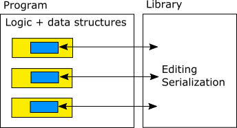

==========
RegScript2
==========

Introduction
============

There is a code very much needed in every game engine, game editor and other graphics/music/media applications, written over and over again, so it makes sense to create a library for it. It's about storing, editing and serializing data structures of various kinds (basically all objects that make up the state/document/game level of a program), each having a set of parameters of various types (integers, floats, strings, vectors, arrays etc.). RegScript2 is an attempt to provide such implementation. It's main goals are to provide:

- A way of storing data structures and their parameters in memory.
- A way of describing these parameters, so they can be accessed in unified way.
- Various ways of reading and writing these parameters, like serialization to/from text and binary formats, editing with a Property Grid in a GUI editor etc.

Design Decisions
================

Before starting implementation, some key design decisions had to be made. First one was whether actual data (parameter values) should be stored:

1. In some structures provided and managed by this library, and just refered somehow by objects making up actual program logic.

2. Directly in objects specific to the program. Then this library needs to have some unified way of acccessing these data.

I chose option 2 because I believe it will make the code of actual applications simpler and more efficient.

Second design decision was about how a description of data structures should be created. Options are:

1. Separate file using dedicated domain-specific language. That would require generating some C++ code from this description, performed as custom build step - which I don't like.

2. Description of data structures build straight in C++ code, together or close to the definition of actual parameters, using some template and macro trickery.

  a) Using macros that define class member variable and register it in the description at the same time.
  b) Member variables are defined normally, while there is a separate code that builds data description. I think this is easier to achieve while not so much more inconvenient than option 2.a.

I have finally chosen option 2.b. I know it may be controversial, but I created this library mostly with accessing the parameters in real-time in mind (as the application runs). If primary goal was to create and editor for filling the data offline and then just load them at program launch, maybe the decision would be different.

Example Code
============

Here is a working example code::

  struct Light
  {
    uint32_t ID;
    std::wstring Name;
    common::VEC3 Position;
    float Range;
    float Intensity;

    static const rs2::StructDesc* GetStructDesc();
  };

  const rs2::StructDesc* Light::GetStructDesc()
  {
    RS2_GET_STRUCT_DESC_BEGIN(Light);
    RS2_ADD_PARAM_UINT(ID, rs2::STORAGE::RAW);
    RS2_ADD_PARAM_STRING(Name, rs2::STORAGE::RAW);
    RS2_ADD_PARAM_VEC3(Position, rs2::STORAGE::RAW);
    RS2_ADD_PARAM_FLOAT(Range, rs2::STORAGE::RAW);
    RS2_ADD_PARAM_FLOAT(Intensity, rs2::STORAGE::RAW);
    RS2_GET_STRUCT_DESC_END();
  }

  void Test()
  {
    Light l1 = {
      1,
      L"Light1",
      common::VEC3(100.f, 0.f, 2.f),
      10.f,
      0.7f
    };

    common::tokdoc::Node serializedRootNode;
    rs2::SaveObjToTokDoc(serializedRootNode, &l1, *Light::GetStructDesc());

    std::wstring serializedString;
    common::TokenWriter tokenWriter(&serializedString);
    serializedRootNode.SaveChildren(tokenWriter);

    wprintf(L"%s", serializedString.c_str());
  }

After calling function ``Test``, output is::

  "ID"="1";
  "Name"="Light1";
  "Position"={
  "100";
  "0";
  "2";
  };
  "Range"="10";
  "Intensity"="0.7";

Design Details
==============

Parameter can have one of following types of storage:

Raw
  Just plain class member variable of specific type, like int or float.
Function
  No actual storage, but pointers to functions are provided that will be used to Get and Set parameter value.
Param
  Variable must be of a special type like IntParam, FloatParam etc.

Using last option, a value of such parameter can be:

1. Constant value, like ``10.5``.
2. Simple waveform (like sine, square, sawtooth etc.) as function of time (or some other input parameter) with given amplitude, frequency and other necessary parameters.
3. Value changing over time according to a specific curve.
4. Expression, specified in a special language, like ``sin(t)*0.5+0.5``.

For the last purpose, I'd ultimately like to create a scripting language. It may start as a simple expressions parser with operators +-\*/% etc. and math functions like sin, cos, but later new features could be added to support conditions, loops, functions, local variables and everything a scripting language should have.

.. That's where the name of this project "RegScript2" comes from. "Reg" is my nickname, "Script" because it's supposed to be a scripting language and "2" because I already had one attempt at creating a scripting language that I abandoned :)

Why create own language instead of using Lua/Python/other existing one?

- I want it to have a familiar syntax similar to C/C++ and HLSL/GLSL. I think the reason for it doesn't need more explanation...
- I want it to be statically typed, so each variable is of one, specific, known type. I basically believe it's always a better way to design programming languages. Moreover, it may be more memory- and time-efficient than having to store and check current type of each value every time it is accessed.
- It needs to be quite low level, with support for data types like int8, uint8, int16, uint16, int32, uint32, float, double, bitwise operators etc. Most scripting languages don't support that, but just some "Number" data type.
- It needs to support data types specific to graphics/physics/3D/game development, like: vectors, matrices, colors, angles, quaternions. Their syntax could be based on shader languages: HLSL or GLSL - with vector swizzles like ``v.xxzw`` etc.
- It needs to be efficient, so that some expressions or functions can be evaluated in every frame of a game. Scripting languages are known to be quite slow. I believe that with the assuption above (especially static typing), implementation of such language can be more efficient than Lua/Python/etc. It might start with executing straight from Abstract Syntax Tree, but later an optimizing compiler could be created to convert it to a bytecode of some simple and fast virtual machine and finally maybe even JIT it to native x86 instructions.
- I want the language to have some syntax dedicated to refering other parameters relative to the current one. It might look like Windows file paths ``..\..\Lights[i]\Intensity`` or alternatively it could be based XPath.

I think the last bullet may be the most distinctive feature of this language. Look at it this way: Most software enviroments we know are made of a bunch of objects in memory used by the core of an application plus a single big scripting environment, consisting of all scripts executed in a sequence. Scripts access the data through some API or binding.

RegScript2 is different. The idea here is to have script code embedded straight in the data. Some parameters of some objects have constant values, while others contain an expression or a bigger piece of code. The time, frequency and order of evaluation of those parameters is determined by the environment, plus they can depend on one another - like cells in Excel spreadsheet.

Advantages of this approach are:

- Some structure of the code is enforced, as the default is to spread it into multiple small pieces instead of writing one big function ``OnUpdate() { /* access all objects and do all computations here... */ }``.
- It may be more efficient. Clear structure and dependencies make it easier to optimize. After resolving dependencies (or when just using double buffering of the whole state), different parameters might be evaluated in parallel, on multiple threads. (Executing all scripts in a serial way all on the main thread is currently a big performance concern for Unity and game engines in general, as far as I know.)

Implementation
==============

Implementation is far from being finished. It actually just started, but I already use the code in my home projects. Here are some implementation-related assumptions and design decisions (some of them may be controversial, I know that):

.. _CommonLib: https://github.com/sawickiap/CommonLib

- It depends on my CommonLib_ library - a C++ library with lots of basic facilities that I always use in my home projects. I know it would be nice to remove this dependency.
- It is tested only on Windows using Visual Studio 2015 so far. I know it would be nice to make it portable to other platforms as well.
- It uses STL - strings, vectors etc.
- It uses Unicode strings - wchar_t*, std::wstring.
- It uses exceptions to report errors.
- It contains console application with unit tests, using Google Test library.

Supported data types implemented so far:

- bool
- int (int32_t)
- unsigned int (uint32_t)
- float
- Enum (with underlying type int32_t, static list of item names and optional item values)
- String (std::wstring)
- GameTime (common::GameTime type, storing a precise timestamp of type int64_t, fetched via QueryPerformanceCounter)
- Vec2, Vec3, Vec4 (common::VEC2, VEC3, VEC4 - structures of floats)
- Fixed size array (of any of these types)
- Struct (structures may be nested as parameters in other structures)

Only constant parameter values are supported currently, so no waveforms, no curves and no functions of a scripting language (it all awaits to be implemented).

Following operations are currently implemented via the unified interface for accessing parameters:

- FindObjParamByPath - finding pointer to a parameter by a path in form of ``ParamName\ParamName[ElemIndex]\ParamName``.
- ValueToStr, StrToValue - printing and parsing parameter value as string, so it can be viewed and modified via some simple text-based interface, like command line (in-game console).
- DebugPrint - printing values of whole structure tree to a string in a simple "Name = Value" form, for debugging purposes.
- TokDoc - serialization to/from a text format that I came up with many years ago and still consider quite good, because it's very minimalistic yet powerful - TokDoc_. It's a little bit similar to JSON, but even simpler.

.. _TokDoc: http://www.asawicki.info/productions/biblioteki/CommonLib_9_0/doc/html/module_tokdoc.html

Of course much more needs to be done here, including:

- Serialization to/from a binary format, optimized for space and time efficiency. For example, library may discover that whole structure is made of POD (Plain Old Data - basically simple types like ints, floats) and read/write it with just a single call instead of doing it parameter by parameter.
- Serialization to/from a binary format that would be forward and backward compatible, e.g. by using RIFF format. A compromise between the binary format above and text format.
- Editing these parameters via some GUI with a powerful and convenient editor providing some Property Grid control.

(This document was written quickly just for the release of the source code. I have more detailed design document of the library, but it's not well organized, so I keep it private for now.)
